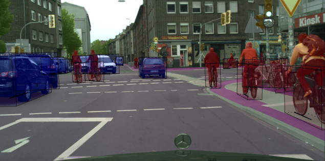
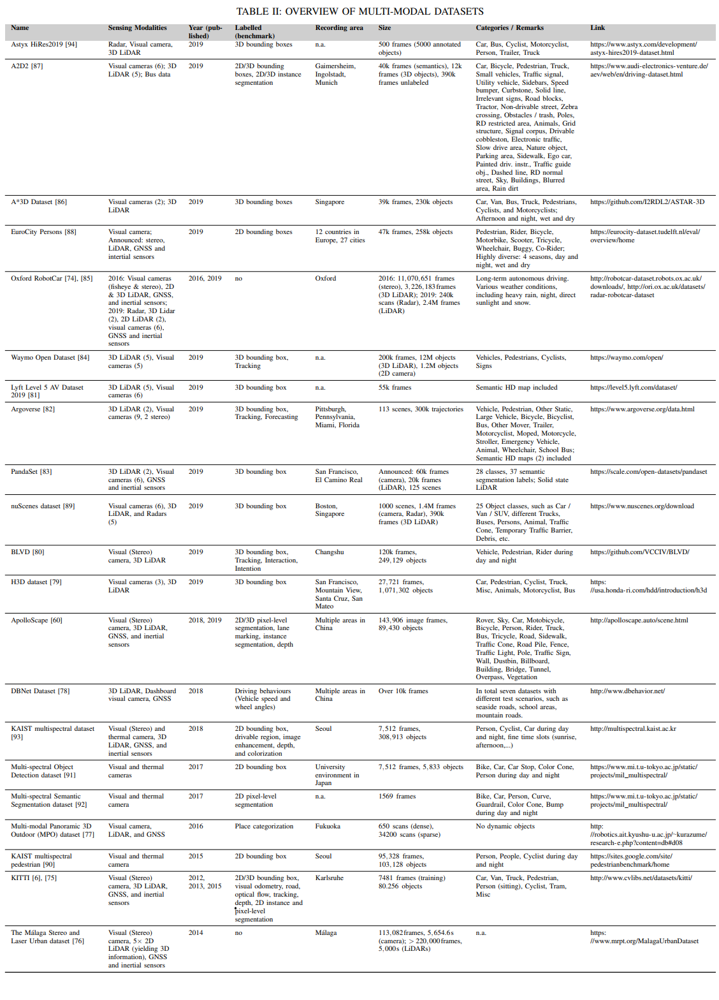

# An overview of real-world autonomous driving datasets

**TL;DR** In the last few years, several annotated real-world datasets of traffic scenes have been published - the most prominent ones will be shown here.

* There are datasets that contain annotations in 2D (either semantic/instance segmentation or 2D object detection i.e. bounding boxes) or 3D (mostly 3D object detection with 9 degrees of freedom. This  subsumes these conclusively:

* Even more sensoric information can be used if both 3D and 2D data are available. This  lists all datasets that can be used as such:

