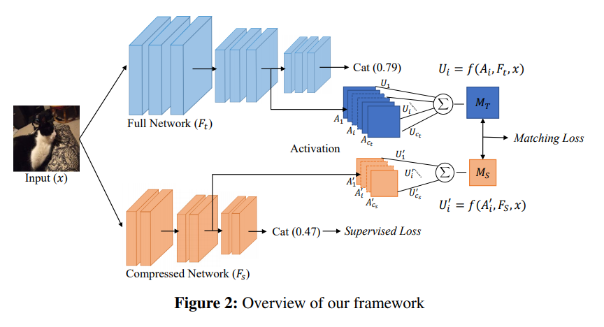
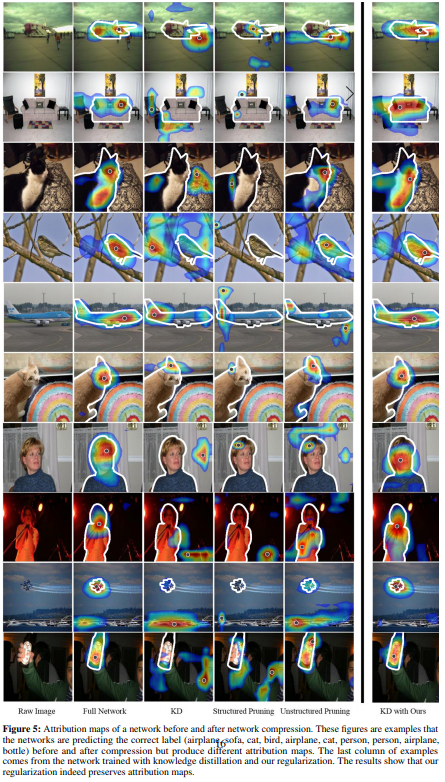

# [Attribution Preservation in Network Compression for Reliable Network Interpretation](https://arxiv.org/pdf/2010.15054v1.pdf)

**Problem**: *Model compression* (for decreasing the memory footprint and latency and increasing throughput) and *input attribution* (for hindsight analysis of network outputs) are both
useful in deep neural networks. However, they compete, as compressing models seems to disturb network outputs in unpredictable ways. 
I will talk about both *model compression* and *input attribution* in the **notes**.

**Solution**:
The authors propose techniques to preserve diverse levels of attribution maps while compressing the networks by regularizing the differences between the sampled attribution maps. Very simply, this is equal to 

*Notes**
* *Model compression* refers to any activity that reduces the size of the network while maintaining the predictive performance of the network within a certain acceptable margin (pruning, distillation, quantization, and more).
* An *attribution* M for an input data point x at a certain layer is a multidimensional tensor containing the importance values of each input or neuron at that
layer which the network considers important in making its according prediction. These attribution values are calculated based on the magnitude of the point and its sensitivity to change of value.
* The attribution preservation is performed by employing a typical teacher-student framework (quote: "attributions in a compressed network are preserved by 
transferring the attributional power of its past self to the current self") - the compressed network being the student and the original, uncompressed network the teacher. Then, the compressed
network is forced to have similar attribution maps as the original network (see below).
There are variants of this approach by incorporating attribution maps channel-wise or incorporating gradients.

* The results are quite convincing across all compression methods and also improve accuracy values. This method might become standard when compressing neural networks in safety-critical scenarios (see below, the rightmost column is the one trained with attribution preservation, the three to the left of it are standard pruning outputs).

