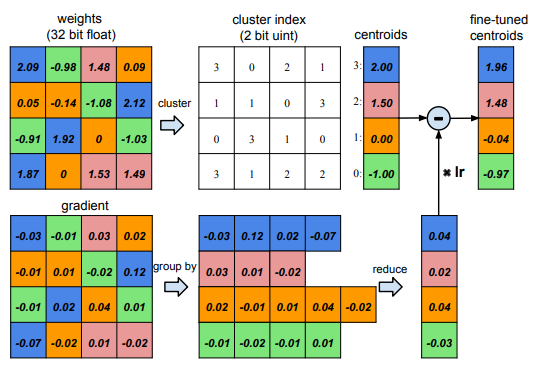

# [Deep Compression: Compressing Deep Neural Networks with pruning, trained quantization and Huffman coding](https://arxiv.org/abs/1510.00149)

**Problem**: Deployment of neural networks is hard on memory and computational resources, which is especially relevant for embedded devices which are highly constrained environments.

**Solution**:
The authors propose techniques to decrease mostly the memory requirements, but also number of computations significantly.

**Notes**
* Two main issues are identified:
    * Large neural networks can't be put into mobile apps due to the size of their weights, which is restricted by the Apple/Google Play Stores.
    * Many applications are battery constrained, making energy consumption a large issue. The authors note that energy consumption is dominated by memory access. Under 45nm CMOS technology, a 32 bit
floating point add consumes 0.9 pJ (picoJoule, one trillionth of a Joule), a 32bit SRAM cache access takes 5 pJ, while a 32bit DRAM
memory access takes 640 pJ, which is 3 orders of magnitude of an add operation. Large networks
do not fit in on-chip storage and hence require the more costly DRAM accesses. Running a 1 billion
connection neural network, for example, at 20fps would require (20Hz)(1G)(640pJ) = 12.8W just
for DRAM access - well beyond the power envelope of a typical mobile device.

* The authors first prune the network by deleting weights below a certain threshold and re-training with the remaining weights after. This reduced the number of connections roughly by a factor of 10. With all these zeros added to the network, the authors store the weights using compressed sparse row (CSR) or compressed sparse column (CSC) formats for compression.
* Also, the authors use a quantization scheme to utilize fewer bits when saving the network. Utilizing results from information theory, they come up with an efficient number of bits - for weights in convolutional layers, they found this to be 8bit, resulting in 256 different weight clusters, for weights in fully connected layers, they found this to be 5 bit, resulting in 32 different weight clusters.
* A third technique is weight sharing, where the authors cluster all weights in a layer and subsequently represent each weight by its cluster centroid. For example, the below Figure shows the weights of a single layer neural network with four input units and
four output units. There are 4x4 = 16 weights originally but there are only 4 shared weights: similar
weights are grouped together to share the same value.

* In the end, the authors leave a great section on *SPEEDUP AND ENERGY EFFICIENCY*, which I recommend readers to read themselves, it's enlightening.

