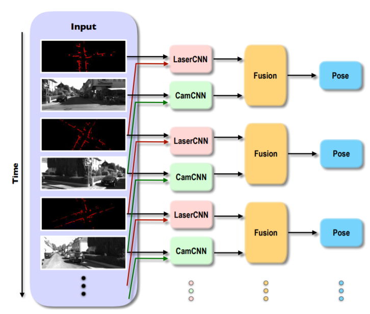
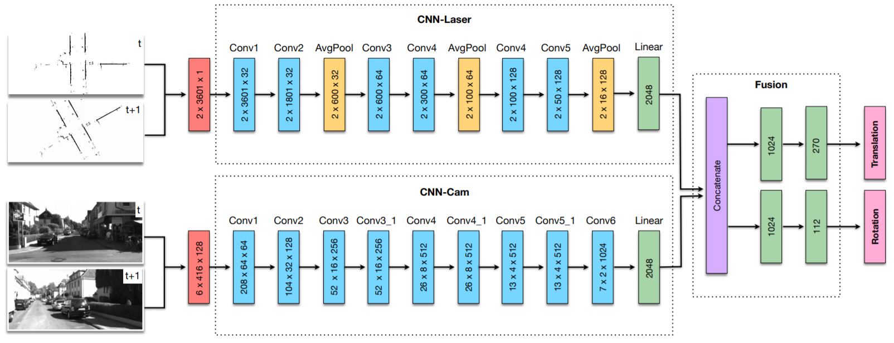

# [Deep Sensor Fusion for Real-Time Odometry Estimation](https://arxiv.org/pdf/1908.00524.pdf)

**Problem**: Self-localization using SLAM algorithms is typically performed using only RGB cameras as sensoric input with corresponding weaknesses. Using 3D LiDAR-Scanning to augment these data is expensive (both hardware- and computation-wise).

**Solution**: Fuse RGB images and cheap 2D LiDAR scans under consideration of temporal information using rather vanilla CNNs. The below figure displays the general idea. The previous frame and current frame are considered in the CNNs. The second figure contains a more accurate architecture. What is interesting is that fusion takes place very late in the network.

**Notes**:
* Their approach tends to learn calibration between both sensors which is neat. Also, they improve on orientation and translation accuracies provided by pure RGB odometry by some 20-40%. This was not to be expected as LiDAR and RGB cameras do have similar strengths.

* However, the authors simply extract a random layer from the Velodyne 3D LiDAR scans. This seems not robust to actual 2D LiDAR scans as the range covered is quite different.
* Another good read for self-localization is [this paper](https://www.sciencedirect.com/science/article/pii/S0386111217301206).
