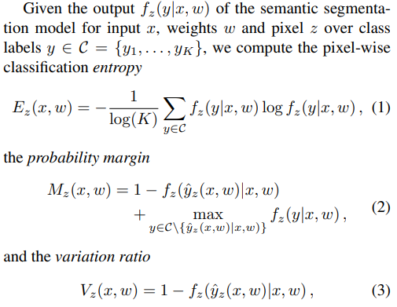
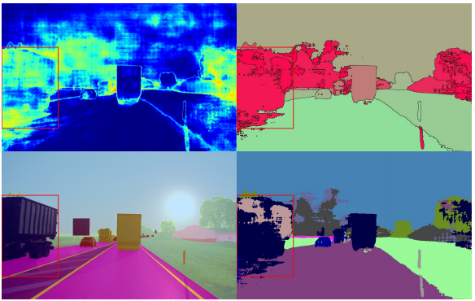

# [Detection and Retrieval of Out-of-Distribution Objects in Semantic Segmentation](https://arxiv.org/pdf/2005.06831.pdf)

**Problem**: Out-of-distribution objects (OOD) in semantic segmentation are hard to detect as they are unbeknownst to the training mechanism by definition. To this day, there are no methods that solve OOD detection reliably.

**Solution**: 
The idea of the authors is to *rate* each segmented patch with regards to 75 different dispersion metrics, i.e. if the softmax score for a certain pixel has a high standard deviation, these metrics should reflect that (see the below Figure). Each of these metrics is calculated per-pixel and aggregated over an image patch with similar segmentation. With these scores (per segmented patch), a regression is run to determine the probability of an OOD object being present.

**Notes**:
* This method treats the neural network like a blackbox, i.e., at inference time it only uses the softmax output of the neural network. As such, inference per-se is not affected by the method and no restrictions on latency or memory requirements apply.
* The authors propose a way of further inspecting weak segmentations by using a technique called image retrieval, where feature vectors of these segments (e.g. obtained by a vanilla VGG) are compared with feature vectors from Imagenet images. This way, weaknesses of the original semantic segmentation algorithm can be revealed.
* It's unclear how the authors trained the regression task used for determining the probability of an OOD object being present. As far as I understood, the authors use a framework called [MetaSeg](https://github.com/mrottmann/MetaSeg) to predict the IoU of a given segment with the ground truth. This, in turn, correlates with the OOD probability. 
* In general, this method is quite clever and runs without OOD labels. However, there is no comparison with benchmarks such as Fishyscapes which, in my view, is a grave weakness of the paper.

