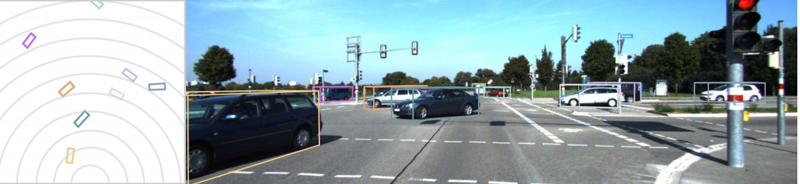
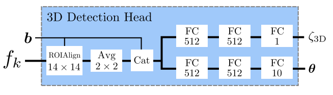

# [Disentangling Monocular 3D Object Detection](http://openaccess.thecvf.com/content_ICCV_2019/papers/Simonelli_Disentangling_Monocular_3D_Object_Detection_ICCV_2019_paper.pdf)

**TL;DR** Deriving 3D object detections from RGB images (no LiDARs, no sensor fusion). Also, fixing Average Precision as the metric.

**Problem**: Deriving 3D bounding boxes is a highly ill-posed problem

**Solution**: 

* Standard approach for 3D object detection: extract features from images using some backbone. Then, use a 2D detection head to derive 2D bounding boxes (4D: center, width and height). Finally, perform 3D object detection using the 2D bounding boxes and the features from the backbone (10D). The below Figures display the backbone, 2D detection head and 3D detection head.

* The authors follow the same approach, their backbone is a ResNet34 with a Feature Pyramid Network (FPN) built on top of it, resulting in features of different scale. The 2D detection head uses a standard [Focal Loss](https://arxiv.org/abs/1708.02002), the 3D detection head a [Huber loss](https://en.wikipedia.org/wiki/Huber_loss).

* A major contribution of this paper is the use of a disentangled loss. Hereby, each semantic contribution to the loss (in the 2D detection head, this would be the center of a bounding box or the dimensions of a bounding box) gets an isolated loss term, while fixing all other contributors to the ground truth (so that they have 0 contribution to the loss at hand).

