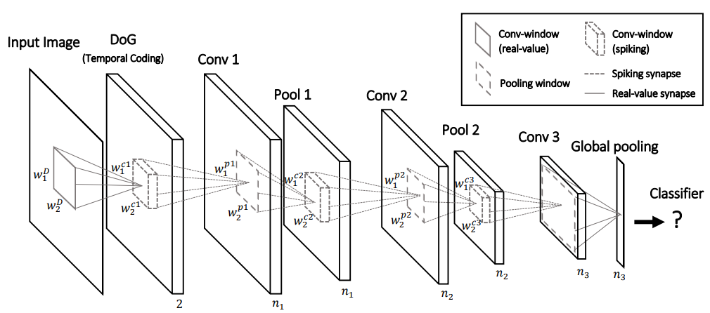

# [STDP-based spiking deep convolutional neural networks for object recognition](https://arxiv.org/pdf/1611.01421.pdf)

**Problem**: It is still unclear how to best encode information and how to best train spiking neural networks (SNNs). In biological neural networks, a process called Spike-timing-dependent plasticity (STDP) governs this.

**Solution**: The authors propose a way to perform STDP in multiple-layer (deep) SNNs using a latency encoding scheme. For details, read on.

**Notes**:
* [Spike-timing-dependent plasticity (STDP)](https://en.wikipedia.org/wiki/Spike-timing-dependent_plasticity) is a biological process that adjusts the strength of connections between neurons in the brain. According to
STDP, synapses through which a presynaptic spike arrived before (respectively after) a postsynaptic one are reinforced (respectively depressed).

* The SNN architecture of the authors is as follows:

The first layer is a [DoG filter](https://en.wikipedia.org/wiki/Difference_of_Gaussians) which resembles the center-surround properties of the
ganglion cells of the retina. Following that, neurons in all convolutional layers are nonleaky integrate-and-fire neurons, which gather input spikes from presynaptic neurons and emit a spike when their internal potentials reach a prespecified threshold. Pooling layers help the network to gain invariance
by doing a nonlinear max pooling operation over a set of neighboring neurons with the same preferred feature.

* *STDP-based learning* entails learning of convolutional layers in the following way: if an input spike to a neuron tends, on average, to occur immediately before that neuron's output spike, then that particular input is made somewhat stronger. If an input spike tends, on average, to occur immediately after an output spike, then that particular input is made somewhat weaker hence: "spike-timing-dependent plasticity". Thus, inputs that might be the cause of the post-synaptic neuron's excitation are made even more likely to contribute in the future, whereas inputs that are not the cause of the post-synaptic spike are made less likely to contribute in the future. 

* The final classification is done using the outputs of the last convolutional layer and then by SVM.

* Across a number of not very challenging datasets, the authors reach good accuracies, which serves as a proof-of-concept. Traditional neural networks still perform way better.
