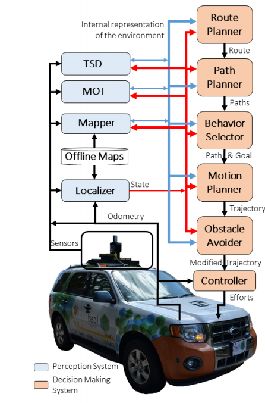

# [Self-Driving Cars: A Survey](https://arxiv.org/pdf/1901.04407.pdf)

**TLDR**: A general overview of self-driving car architecture (often perception and decision-making) and subdivided system components.

* A typical Architecture of a self-Driving car in the following Figure. The different subsystems are described below.  

* The **perception** module consists of all sensors - LiDAR, RaDAR, cameras, IMUs, GNSS/RTK, odometers etc., the **decision making** module is responsible for navigating the car
from its initial position to the final goal defined by the user, considering the current car's State and the internal representation of the environment, as
well as traffic rules and passengers' safety and comfort. 
The **Localizer** subsystem (Figure 1) is responsiblen for estimating the car's State (pose, linear velocities, angular velocities, etc.) in relation to static maps of the environment. 
These static maps, or **Offline Maps**, are
computed automatically before the autonomous operation, typically using the sensors of the self-driving car itself, although
manual annotations (i.e., the position of pedestrian crosswalks
or of traffic lights) or editions (for removing non-static objects
captured by the sensors) are usually required. A self-driving car may use more modi of offline maps, such as occupancy grid maps, remission maps or landmark maps.
The **Mapper** subsystem receives as input the Offline Maps
and the self-driving car's State, and generates as output the online map. This online map is typically a merge of information
present in the Offline Maps and an occupancy grid map computed online using sensors’ data and the current car's State. The **Moving Objects
Tracker** subsystem receives the Offline Maps and the self-driving car's State, and detects and tracks,
i.e., calculates the pose and velocity of, the nearest moving obstacles (e.g., other vehicles and pedestrians). The **Traffic Signalization Detector** subsystem is responsible for the detection and recognition of vertical and horizontal traffic signalization (lane markers / traffic lights). The **Route Planner** calculates a sequence of waypoints from start to finish under constraints given by the offline map. Given a Route, the **Path Planner** subsystem computes, considering the current self-driving car’s State and the internal representation of the environment as well as traffic rules a set of paths. The **Behavior Selector** subsystem is responsible for choosing the current driving behavior, such as lane keeping, intersection handling, traffic light handling. The **Motion Planner** subsystem is responsible for computing a Trajectory, T, from the current self-driving car’s State to the current Goal, which follows the Path defined by the Behavior Selector, satisfies car's kinematic and dynamic constraints, and provides comfort to the passengers.
The **Obstacle Avoider** subsystem receives the Trajectory computed by the **Motion Planner** and changes it (typically reducing the velocity), if necessary, to avoid collisions. Finally, the **Controller** subsystem receives the Motion Planner trajectory, eventually modified by the Obstacle Avoider subsystem, and computes and sends Effort commands to the actuators of the steering wheel, throttle and brakes in order to make
the car execute the Modified Trajectory as best as the physical
world allows.

The above points will be dealt with extensively in the following.

- **Localizer subsystem**: Depends mostly on GPS, which is unreliable in urban scenarios. Thus, other sensor modalities such as LiDAR, cameras or hybrid approaches can feed an EKF or similar for localization.
- **Mapper subsystem**: There are metric (as a regular grid) and topological (as a graph of irregular nodes) representations of the environment. A very common metric representation is [Occupancy grid mapping](https://en.wikipedia.org/wiki/Occupancy_grid_mapping) where the occupancy of grid cells (in the range of centimeters) is calculated using sensor data. [GraphSLAM](https://en.wikipedia.org/wiki/GraphSLAM) imposes soft contraints onto a path. Combining these two in an online manner (FastSLAM) is a very common occurance in self-driving cars these days.
- **Road mapper subsystem**  
