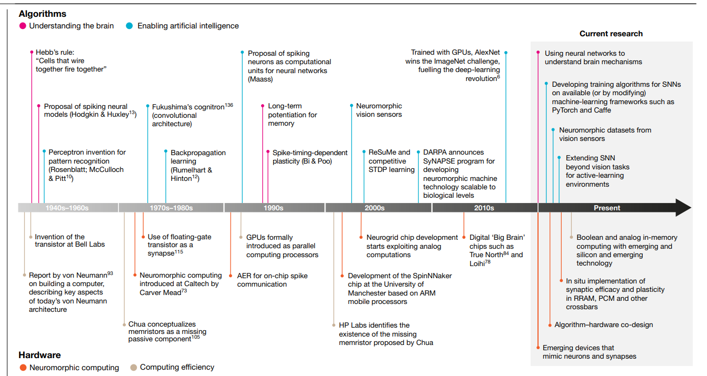
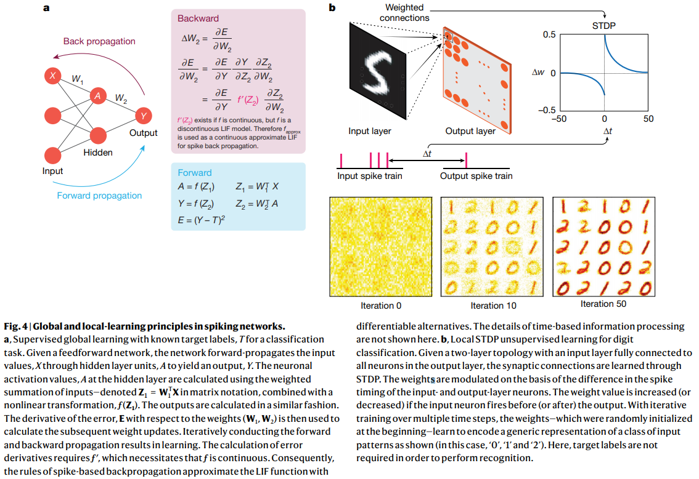

# Towards spike-based machine intelligence with neuromorphic computing

**TL;DR** Spike-based neural networks resemble the brain much more closely. This article makes a strong case for enabling machine intelligence through synergistic advancements in both hardware (computing) and algorithms (intelligence)

* The most important distinction between current neural networks and spiking neural networks (SNNs) is in the nature of information processing. The
former generation uses real-valued computation (say, the amplitude of the signal), whereas SNNs use the timing of the signals (or the spikes) to process information. 

* Spikes are essentially binary events, either 0 or 1. A neuronal unit in an SNN is only active when it receives or emits spikes—it is therefore event-driven, which can contribute to energy efficiency over a given period of time. Also, as the inputs to weights are binary, accumulation comes down to a less computationally intensive summation operation (as opposed to a weighted sum as in NNs. The below Figure displays a very simple spiking NN.

* The below Figure shows historical and future milestones in hardware and architecture, leading towards AI and neuromorphic computing.

* Training SNNs is still tough and is based on [synaptic plasticity](https://en.wikipedia.org/wiki/Synaptic_plasticity) - the modulation of synaptic
weights, which translates to learning in SNNs - relies on the relative
timing of pre- and post-synaptic spikes. Also, training data (i.e. "spike trains") is hard to obtain from, say, static-image databases like CIFAR.
Practically, in terms of accuracy, SNNs are still behind their second-generation deep-learning counterparts in most learning tasks.
The below Figure displays classical NN learning (left) and SNN learning (right).

* The design of neuromorphic [chips](https://en.wikipedia.org/wiki/Neuromorphic_engineering) and [sensors](https://www.ncbi.nlm.nih.gov/pmc/articles/PMC4809886/) is projected to fit to the principles of SNNs much more closely. Research directions are clock-less hardware designs (asynchronous address event representation), NOCs (networks-on-chip) for spike communication, in-memory computing and memristors.

