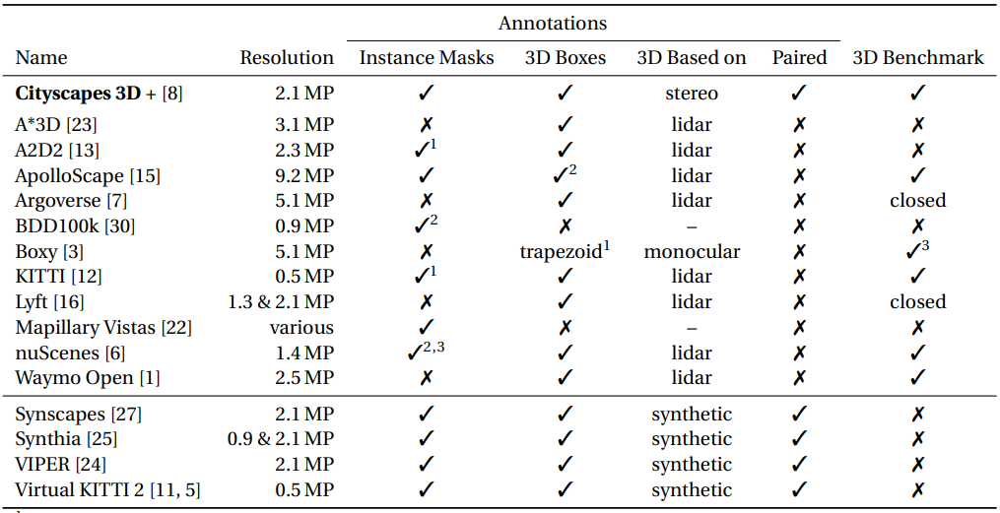

# Towards spike-based machine intelligence with neuromorphic computing

**TL;DR** Spike-based neural networks resemble the brain much more closely. This article makes a strong case for enabling machine intelligence through synergistic advancements in both hardware (computing) and algorithms (intelligence)

* The most important distinction between current neural networks and spiking neural networks (SNNs) is in the nature of information processing. The
former generation uses real-valued computation (say, the amplitude of the signal), whereas SNNs use the timing of the signals (or the spikes) to process information. 

* Spikes are essentially binary events, either 0 or 1. As can be seen in Fig. 3a, a neuronal unit in an SNN is only active when it receives or emits spikes—it is therefore event-driven, which can contribute to energy efficiency over a given period of time. The below Figure displays a very simple spiking NN.

* The below Figure shows historical and future milestones in hardware and architecture, leading towards AI and neuromorphic computing.

