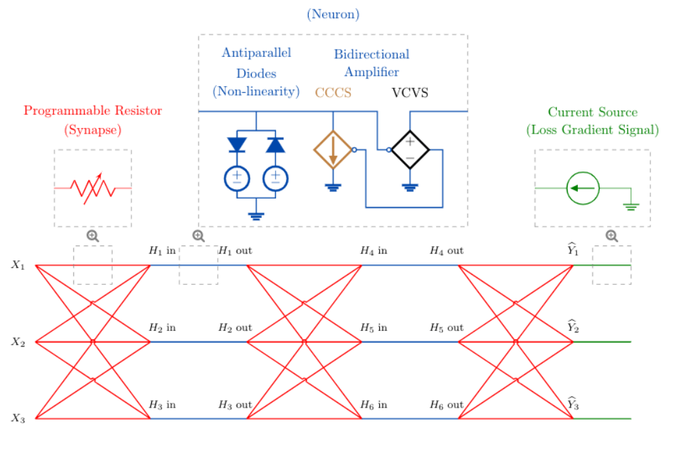

# [Training End-to-End Analog Neural Networks with Equilibrium Propagation](https://arxiv.org/pdf/2006.01981.pdf)

**TL;DR** Train analog neural networks using diodes as activations and memristors as weights, enabling new generations of AI chips.

**Problem**: The **von Neumann bottleneck** describes the problem arising from the separation of memory and processing in today's deep learning: moving the data back and forth between memory and compute units leads to grave performance degradation. Building fast and energy-efficient neural networks requires a non-von Neumann computing paradigm which unifies memory and processing, by performing neural computations at the physical location of the synapses, where the strength of the connections (the weights of the neural network) are stored and adjusted. 

**Solution**: The update rule for each conductance is local and relies solely on the voltage drop across the corresponding resistor. In simulation, the authors show that this computes the gradient of the loss function.

**Notes**: 

* The computations involved in conventional neural networks
consist in large parts of tensor multiplications. A key insight is that the multiply and accumulate
operations of tensor multiplications can be performed in the analog domain by utilizing Ohm’s law
and Kirchhoff’s current law, respectively

